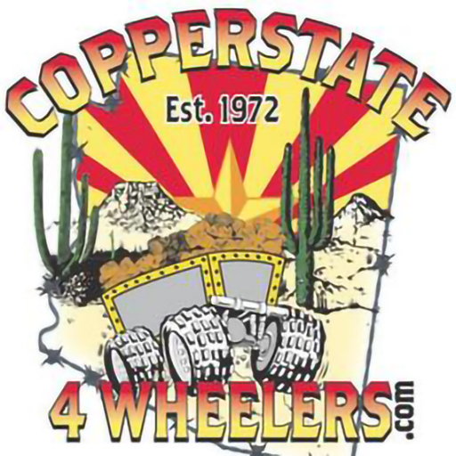

## How To Add A Run 

* TODO: link to a video tutorial / walkthrough
* tl;dr
    * Add a new file to [`/events`](./events)

## Under The Hood

[`/website`](./website)

The website is built with [Astro](https://astro.build/).
